<div align="center">


<br/><br/>

### 🧴 피부를 기억하지 말고, 기록하세요.

**낫트데이 (Not Trouble Day)**는  
피부 상태 · 스킨케어 루틴 · 생활 데이터를 연결하여  
**오늘의 피부를 기록하고 변화의 흐름을 돌아볼 수 있도록 돕는 AI Wellness Service**입니다.

<br/>

**Made by Team ToMeta**

<br/>


<br/>


<br/>

[](https://github.com/LikeLionUniv-INU/14th-toMeta-frontend)
[](https://github.com/LikeLionUniv-INU/14th-toMeta-backend)

<br/>


</div>

<br/>

> **낫트데이 Frontend**는 피부 상태, 사용 화장품, 피부 사진과 Health Connect 생활 데이터를  
> 하나의 사용자 흐름으로 연결하고, Daily · Weekly AI Report를 시각화하는 React 기반 Hybrid Application입니다.

---

## ✨ Frontend at a Glance

| | 핵심 설계 |
| --- | --- |
| 📱 **Hybrid App** | React Web UI + Android WebView + Native Bridge |
| ❤️ **Health Connect** | Web에서 Native 권한 요청 후 결과 기반 UI Flow 처리 |
| 🔐 **Session** | `withCredentials` 기반 Anonymous Session Cookie |
| 📝 **Daily Record** | 피부 상태 · 화장품 · 음식 · 사진 · 메모 통합 기록 |
| 🧴 **Cosmetic Pouch** | 화장품 검색 · 직접 등록 · Morning/Night Routine |
| 📸 **Image Upload** | AWS S3 Presigned URL 기반 Direct Upload |
| 🤖 **AI Report** | Backend에 저장된 Daily / Weekly AI Report 조회 |
| 📊 **Visualization** | Recharts 기반 피부·생활 데이터 시각화 |
| 🌐 **API Layer** | Domain API Module + Centralized Axios Client |
| 🚀 **Deployment** | Vite Proxy + Vercel Rewrite + SPA Fallback |
| 🧹 **Code Quality** | ESLint · Prettier · CodeRabbit Automated Review |

---

## 📑 Contents

- 1. About 낫트데이
- 2. Problem
- 3. Solution
- 4. Core User Flow
- 5. Product Loop
- 6. Key Features
- 7. Frontend Architecture
- 8. Engineering Highlights
- 9. Health Connect Integration
- 10. Record & Image Pipeline
- 11. Report Experience
- 12. UI / UX
- 13. API Architecture
- 14. Tech Stack
- 15. Code Quality & Collaboration
- 16. Deployment
- 17. AI in 낫트데이
- 18. Market & Scalability
- 19. Track Fit
- 20. Project Structure
- 21. Getting Started
- 22. Screens
- 23. Team ToMeta
- 24. References

---

# 1. About 낫트데이

## 🧴 Not Trouble Day

**낫트데이(Not Trouble Day)**는  
`Not Trouble Day`, 즉 **피부 트러블로 고민하지 않는 하루**라는 의미를 담고 있습니다.

낫트데이는 피부 문제가 생긴 순간만 관리하는 것보다,

> **매일의 피부와 생활을 기록하고, 변화의 흐름을 이해하는 것**

에서 피부 관리가 시작된다고 생각합니다.

```text
Today's Skin
     +
Skincare Routine
     +
Daily Life
     ↓
Personal Skin History
```

사용자가 자신의 피부 변화를 기억에 의존하지 않고  
**기록을 근거로 다시 돌아볼 수 있는 경험**을 만드는 것이 낫트데이의 목표입니다.

---

# 2. Problem

## 피부가 나빠졌을 때, 그 전 며칠을 얼마나 정확히 기억할 수 있을까요?

여드름은 전 세계 인구의 약 **9.4%**가 영향을 받는 것으로 보고된 흔한 피부 문제입니다.

하지만 사용자가 피부 변화를 돌아보기 위해 필요한 정보는 서로 다른 곳에 흩어져 있습니다.

| 피부를 돌아보기 위해 필요한 정보 | 일반적인 위치 |
| --- | --- |
| 오늘 피부 상태 | 기억 |
| 사용한 화장품 | 화장대 / 기억 |
| 피부 사진 | 사진첩 |
| 수면 데이터 | 건강 앱 |
| 운동 데이터 | 건강 앱 |
| 음식 기록 | 기억 |
| 며칠 전 피부 상태 | 기억 |

그래서 피부 상태가 갑자기 달라지면 사용자는 흔히 이렇게 생각합니다.

> "잠을 못 자서 그런가?"  
> "새로 바꾼 화장품 때문인가?"  
> "며칠 전에는 어떤 제품을 사용했지?"

### 우리가 정의한 문제

> **피부와 관련된 데이터가 없는 것이 아니라, 서로 연결되어 있지 않다.**

낫트데이는 흩어진 데이터를 **날짜를 기준으로 하나의 개인 Timeline으로 연결하는 것**에서 시작했습니다.

---

# 3. Solution

낫트데이는 사용자가 직접 기록한

- 피부 상태
- 피부 사진
- 사용한 화장품
- Morning / Night 스킨케어 루틴
- 음식
- 자유 메모

와 Android **Health Connect**의 생활 데이터를 함께 축적합니다.

```text
Skin Record
     +
Cosmetic Routine
     +
Health Connect
     ↓
Daily Context
     ↓
Daily AI Report
     ↓
Accumulated History
     ↓
Weekly AI Report
```

## Before → 낫트데이

| Before | 낫트데이 |
| --- | --- |
| 피부 상태를 기억에 의존 | 날짜별 피부 상태 기록 |
| 사용 제품을 기억하기 어려움 | 개인 Cosmetic Pouch |
| 매일 같은 화장품을 반복 입력 | Morning / Night Routine |
| 생활 데이터가 건강 앱에 분리 | Health Connect 연동 |
| 피부 사진이 갤러리에 흩어짐 | 날짜별 피부 사진 연결 |
| 데이터를 함께 비교하기 어려움 | Daily Report |
| 장기적인 변화 파악이 어려움 | Weekly Timeline & Chart |

> ### Record · Connect · Reflect
>
> **기록하고, 연결하고, 다시 돌아본다.**

---

# 4. Core User Flow

낫트데이의 핵심 사용자 흐름은  
**온보딩 → 기록 → 리포트 → 다시 기록**으로 이어집니다.

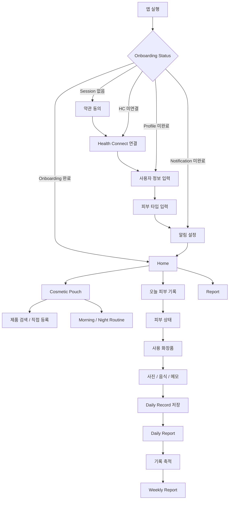

## Resume Flow

사용자가 앱을 중간에 종료해도 이미 완료한 정보를 다시 입력하지 않습니다.

```text
Session 없음
└── 약관 동의

Health Connect 미연결
└── Health Connect 연결

Profile 미완료
└── 사용자 정보 입력

Notification 설정 미완료
└── 알림 설정

모두 완료
└── Home
```

Splash 화면은 Backend의 온보딩 상태를 확인하고  
**실제 저장된 진행 상태에 따라 다음 Route를 결정**합니다.

---

# 5. Product Loop

낫트데이의 핵심은 일회성 AI 분석이 아니라  
**기록이 다음 기록의 이유가 되는 반복 구조**입니다.

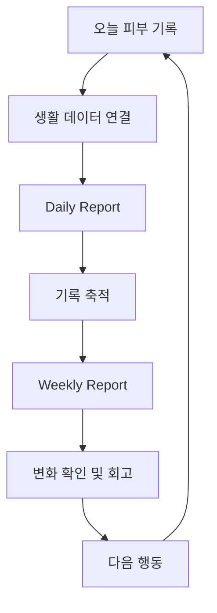

```text
             Record
            /      \
       Connect    Next Action
          |           |
        Analyze ← Reflect
```

사용 기간이 길어질수록 사용자의 **개인 피부 History**가 만들어집니다.

---

# 6. Key Features

## 6.1 Daily Skin Record

하루의 피부와 일상을 하나의 기록으로 남깁니다.

```text
오늘 피부 상태
      ↓
Morning Routine
      ↓
Night Routine
      ↓
음식 기록
      ↓
피부 사진
      ↓
자유 메모
```

기록 데이터:

```text
Daily Record
├── Skin Status
├── Morning Cosmetics
├── Night Cosmetics
├── Food Memo
├── Skin Images
└── Memo
```

날짜 기반 Route를 사용해 오늘뿐 아니라 과거의 기록도 조회할 수 있습니다.

```text
/todaynote
/todaynote/:date

/record
/record/:date
```

---

## 6.2 Health Connect

사용자가 이미 스마트폰이나 스마트워치를 통해 생성하고 있는 건강 데이터를 다시 직접 입력하지 않도록 합니다.

```text
React
  ↓
ToMetaNative Bridge
  ↓
Android Native
  ↓
Health Connect
```

> [!NOTE]
> React가 Health Connect SDK를 직접 제어하지 않습니다.
>
> Frontend는 **Native 기능 요청 → 결과 수신 → UI 상태 처리 → Navigation**에 집중합니다.

---

## 6.3 Cosmetic Pouch

사용자는 자주 사용하는 화장품을 자신의 Pouch에 저장할 수 있습니다.

### Search Registration

```text
제품명 검색
    ↓
Search Result
    ↓
제품 선택
    ↓
My Pouch
```

### Manual Registration

검색으로 원하는 제품을 찾지 못한 경우에도 Flow가 끊기지 않습니다.

```text
제품명
  ↓
제품 카테고리
  ↓
주요 성분
  ↓
직접 등록
```

---

## 6.4 Morning / Night Routine

자주 함께 사용하는 화장품은 스킨케어 세트로 관리합니다.

```text
          진정 루틴

토너 → 세럼 → 수분 크림

Usage
Morning / Night / Both
```

매일 여러 제품을 반복해서 검색하고 선택하는 대신 저장된 Routine을 사용할 수 있어 **반복 입력 비용을 줄입니다.**

---

## 6.5 Home Dashboard

Home은 단순 메뉴 화면이 아니라 사용자의 현재 상태를 요약하는 Dashboard입니다.

```text
이번 주 피부 상태
       ↓
오늘 기록 여부
       ↓
이전 Report 요약
       ↓
오늘의 실천 가이드
       ↓
다시 기록
```

최근 피부 상태와 기록 여부를 확인하고 특정 날짜의 기록 또는 Report로 바로 이동할 수 있습니다.

---

## 6.6 Daily Report

하루 동안 연결된 피부와 생활 데이터를 하나의 리포트로 확인합니다.

주요 정보:

- 수면 시간
- 평균 피부 온도
- 운동 시간
- 소모 칼로리
- 생리주기
- 평균 산소포화도
- AI Analysis
- Personalized Solution
- 사용자 Note

Frontend가 OpenAI를 직접 호출하지 않습니다.

```text
Daily Report Page
       ↓
Spring REST API
       ↓
Stored Daily Report
       ↓
UI Rendering
```

> [!IMPORTANT]
> **AI Generation과 사용자 Report 조회를 분리했습니다.**
>
> 사용자가 화면을 열 때마다 AI 응답을 기다리는 구조가 아니라  
> Backend에서 생성·저장한 Report를 Frontend가 조회합니다.

---

## 6.7 Weekly Report

하루의 단편적인 값보다 **한 주 동안의 변화**를 확인할 수 있도록 Weekly Report를 제공합니다.

```text
MON   TUE   WED   THU   FRI   SAT   SUN

Skin Status
Sleep
Skin Temperature
Exercise
Calories
Menstrual Cycle
SpO₂
Skin Photos
```

생활 데이터는 **Recharts 기반 Chart 및 Timeline UI**로 시각화합니다.

Weekly Report에는

- Weekly Summary
- AI Analysis
- Personalized Solution
- 사용자 Note

가 함께 제공됩니다.

---

# 7. Frontend Architecture

낫트데이는 **React Web Application을 Android WebView 안에서 실행하는 Hybrid Application**입니다.

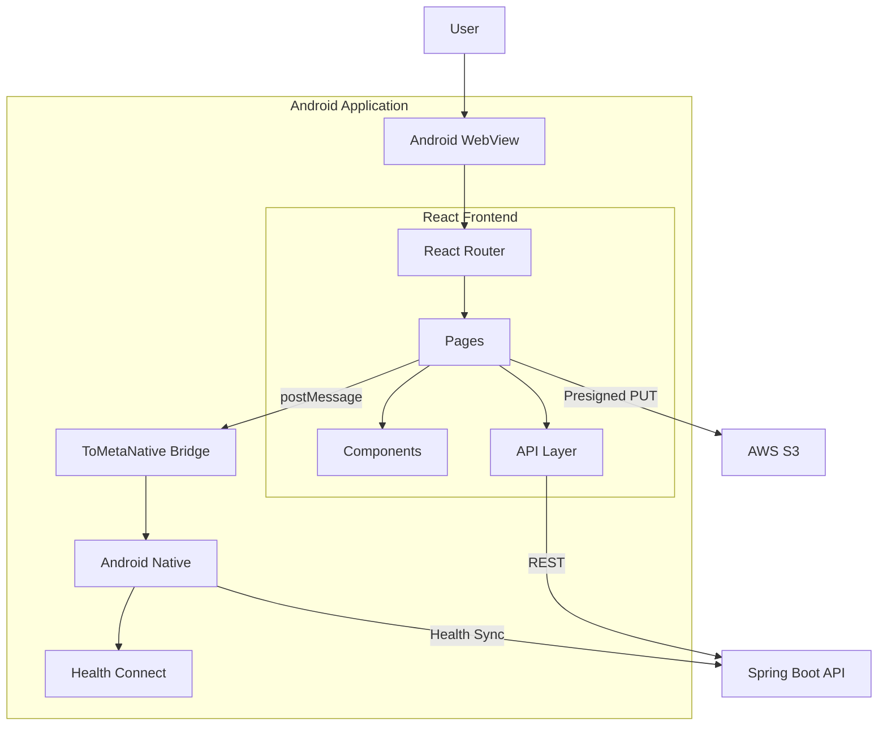

## Responsibility

| Layer | Responsibility |
| --- | --- |
| **React Router** | 화면 Route 및 Navigation |
| **Pages** | 화면 단위 User Flow |
| **Components** | 재사용 가능한 UI |
| **API Layer** | Backend REST 통신 |
| **styled-components** | Component Styling |
| **ToMetaNative Bridge** | Web ↔ Native Communication |
| **Android Native** | Health Connect / Android Permission |
| **Spring Backend** | Business Logic / AI / Persistence |
| **AWS S3** | 피부 이미지 Storage |

---

# 8. Engineering Highlights

## 8.1 Web UI와 Native 기능을 분리했습니다.

Health Connect를 사용하기 위해 전체 서비스를 Native Android로 구현하는 대신  
UI는 React로 구성하고 Platform 종속 기능만 Android Native에 위임합니다.

```text
React
├── UI
├── Interaction
├── Routing
├── Visualization
└── Backend API

Android Native
├── Health Connect
├── Android Permission
├── Background Sync
└── Device Integration
```

React에서는 실제 Android SDK를 직접 다루지 않고 Bridge에 명령을 전달합니다.

```javascript
window.ToMetaNative.postMessage(
  'requestHealthConnectPermissions',
);
```

---

## 8.2 Native 응답을 상태 기반으로 처리합니다.

Native 요청을 단순 Boolean 결과 하나로 처리하지 않습니다.

```text
Health Connect Result
        │
        ├── granted
        ├── denied
        ├── unavailable
        ├── busy
        ├── cancelled
        ├── session_missing
        └── connection_failed
```

Frontend는 Native 결과를 해석해 화면 상태와 Navigation을 결정합니다.

이를 통해 Android 구현 세부사항과 React UI Flow의 책임을 분리합니다.

---

## 8.3 Cookie Session을 공통 Axios Client에서 처리합니다.

낫트데이 MVP는 별도의 로그인 과정 대신 Anonymous Session Cookie를 사용합니다.

```javascript
const api = axios.create({
  baseURL: import.meta.env.VITE_API_URL || '',
  headers: {
    'Content-Type': 'application/json',
  },
  withCredentials: true,
});
```

각 API 함수가 인증 처리를 반복하지 않습니다.

```text
Page
 ↓
Domain API
 ↓
Axios Instance
 ↓
Cookie 자동 포함
 ↓
Spring Backend
```

Frontend에서 Session Token을 LocalStorage에 직접 저장하거나 개별 Request Header에 삽입하지 않습니다.

---

## 8.4 HTTP Error 처리를 중앙화했습니다.

공통 Axios Response Interceptor를 통해 Error 처리 로직을 한 곳에서 관리합니다.

```text
HTTP Error
   ↓
Backend Message 존재?
   └── Backend Message 사용

Request Timeout
   └── 시간 초과 Message

Network Error
   └── 네트워크 연결 Message
```

각 Page에서 Axios Error Parsing을 반복하지 않도록 구성했습니다.

---

## 8.5 API를 Domain 단위로 분리했습니다.

Page Component 안에서 Endpoint 문자열을 직접 관리하지 않습니다.

```text
src/api
│
├── axios.js
├── onboarding.js
├── healthConnect.js
├── home.js
├── user.js
├── records.js
├── cosmetics.js
└── reports.js
```

호출 구조:

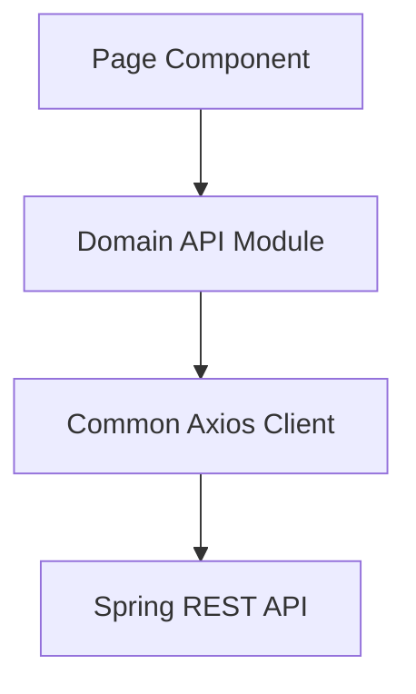

UI와 Backend API Contract의 변경 영향을 분리합니다.

---

## 8.6 피부 사진은 S3에 직접 업로드합니다.

일반 Business API와 이미지 Binary 전송을 분리합니다.

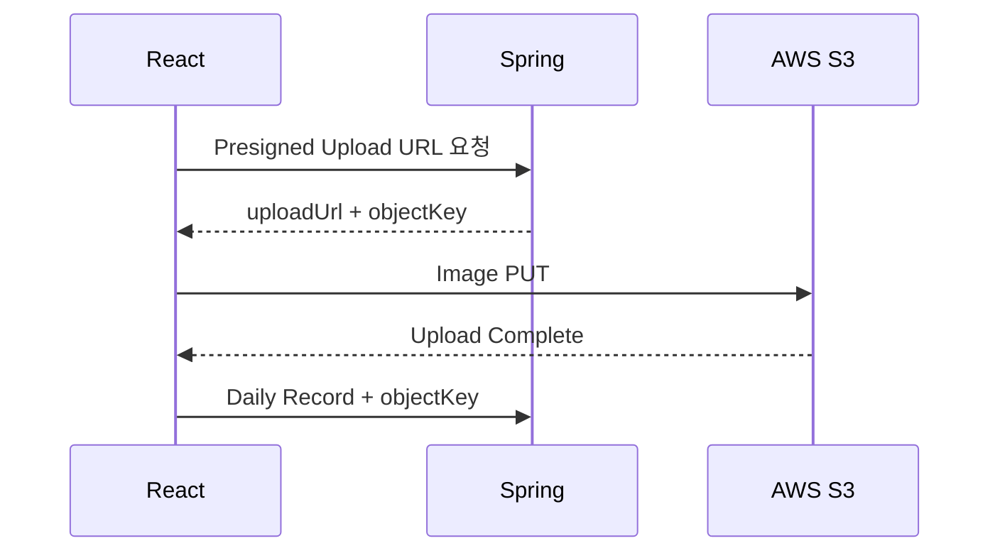

React에서는 Presigned URL을 받은 뒤 Browser에서 S3에 직접 `PUT`합니다.

```text
Image Binary
React ─────────────▶ AWS S3

Business Data
React ─────────────▶ Spring Backend
```

Application Server가 이미지 전체를 중계하지 않는 구조입니다.

---

## 8.7 Report 조회를 AI latency와 분리했습니다.

다음과 같이 사용자가 화면에 들어올 때마다 AI를 직접 호출하지 않습니다.

```text
User enters Report
        ↓
AI Request
        ↓
Wait
```

대신

```text
Backend
├── AI Report Generation
└── Persistence

Frontend
├── Stored Report Request
└── Visualization
```

구조를 사용합니다.

Frontend는 AI Orchestration이 아니라 **검증되고 저장된 Report를 사용자에게 표현하는 역할**에 집중합니다.

---

# 9. Health Connect Integration

## Web → Native

사용자가 Health Connect 권한 요청 버튼을 누르면 Bridge를 통해 Android Native에 요청합니다.

```text
User
 ↓
React Button
 ↓
ToMetaNative.postMessage
 ↓
Android Native
 ↓
Health Connect
```

---

## Native → Web

Android에서 권한 처리가 완료되면 Message Event로 결과를 전달합니다.

```text
Android Native
       ↓
Bridge Message
       ↓
React Event Listener
       ↓
Status Parsing
       ↓
UI / Navigation
```

---

## 이미 연결된 사용자는 권한 화면을 반복하지 않습니다.

Health Connect 화면 진입 시 Backend의 연결 상태를 먼저 확인합니다.

```text
Health Connect Page
        ↓
Connection Status API
        ↓
Already Connected?
        │
        ├── Yes → 다음 Onboarding Step
        │
        └── No  → Permission Request
```

> [!TIP]
> Native 권한뿐 아니라 Backend의 실제 Health Connection 상태까지 확인해  
> 사용자가 완료한 과정을 반복하지 않도록 합니다.

---

# 10. Record & Image Pipeline

Daily Record는 일반 입력과 이미지 업로드를 하나의 사용자 흐름에서 연결합니다.

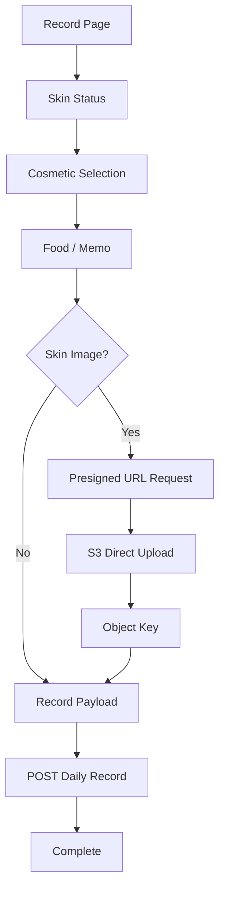

Frontend Flow:

```text
1. File Metadata → Backend
2. Presigned URL 발급
3. Browser → S3 PUT
4. Object Key 확보
5. Daily Record Payload에 Object Key 포함
6. Backend 저장
```

파일 Storage와 Business Data 저장을 분리합니다.

---

# 11. Report Experience

## Daily Report

```text
Date
 │
 ├── Health Summary
 │   ├── Sleep
 │   ├── Skin Temperature
 │   ├── Exercise
 │   ├── Calories
 │   ├── Menstrual Cycle
 │   └── SpO₂
 │
 ├── AI Analysis
 ├── Personalized Solution
 └── User Note
```

---

## Weekly Report

Weekly Report에서는 7일간의 변화를 비교합니다.

```text
          MON TUE WED THU FRI SAT SUN

Skin       ●   ●   ●   ●   ●   ●   ●
Sleep      ▃   ▅   ▂   ▆   ▇   ▃   ▅
Temp       ─╮──╯────╮──────╯────────
Exercise   ■       ■   ■       ■
```

### Visualization Principle

```text
Raw Data
   ↓
Chart / Timeline
   ↓
Trend Recognition
   ↓
AI Summary
```

AI의 분석 문장만 보여주는 것이 아니라  
**분석의 배경이 되는 사용자의 실제 기록도 함께 확인할 수 있는 UI**를 지향합니다.

---

# 12. UI / UX

## Mobile First

낫트데이는 Android WebView에서 반복적으로 사용하는 모바일 서비스입니다.

```text
Mobile Viewport
Touch Interaction
Bottom Navigation
Responsive Layout
100dvh
```

Desktop UI를 축소하는 방식보다 모바일 사용성을 우선합니다.

---

## Progressive Onboarding

시작부터 모든 데이터를 한 화면에 입력받지 않습니다.

```text
Privacy
   ↓
Health Connect
   ↓
Profile
   ↓
Skin Type
   ↓
Notification
```

완료 상태는 Backend에서 복구하여 불필요한 재입력을 줄입니다.

---

## Repeated Input Reduction

매일 같은 화장품을 다시 검색하지 않도록

```text
Cosmetic Pouch
       +
Saved Routine
```

을 제공합니다.

---

## Skin Status Visualization

피부 상태는 긴 설명보다 빠르게 인식할 수 있도록 단계화된 UI를 사용합니다.

```text
Skin Status
   ↓
Color + Face
   ↓
Weekly Timeline
```

---

## Missing Data를 실제 값과 구분합니다.

```text
Record 존재
└── Skin Status 표시

오늘 Record 없음
└── 기록 CTA

과거 Record 없음
└── Empty State

미래
└── Disabled
```

데이터가 없다는 사실 자체를 UI 상태로 표현합니다.

---

## Interaction-based Splash

첫 화면에서 바로 Form을 보여주는 대신 캐릭터와 Interaction을 통해 서비스에 진입합니다.

```text
Skin Interaction
      ↓
여 박사 등장
      ↓
Service Introduction
      ↓
Logo
      ↓
Onboarding Status Check
```

기능적인 첫 진입 과정도 낫트데이의 Visual Identity와 연결합니다.

---

# 13. API Architecture

Frontend API는 Domain 단위로 분리합니다.

| Module | Responsibility |
| --- | --- |
| `axios.js` | 공통 HTTP Client |
| `onboarding.js` | 온보딩 상태 및 약관 |
| `healthConnect.js` | Health Connect 연결 상태 |
| `home.js` | Home Dashboard |
| `user.js` | User Profile / Setting |
| `cosmetics.js` | Cosmetic / Set / Ingredient |
| `records.js` | Daily Record / Skin Image |
| `reports.js` | Daily / Weekly / Monthly Report |

## General Request

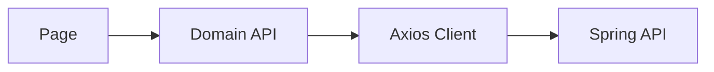

## Image Request

```text
React
 │
 ├── Spring Backend
 │    └── Presigned URL
 │
 ├── AWS S3
 │    └── Image PUT
 │
 └── Spring Backend
      └── Daily Record + objectKey
```

## Session

```text
Browser Cookie
      ↓
Axios withCredentials
      ↓
Spring Backend
      ↓
Anonymous Session
```

---

# 14. Tech Stack

<div align="center">


</div>

<br/>

## Frontend Core

| Category | Technology | Role |
| --- | --- | --- |
| Language | **JavaScript** | Frontend Core |
| UI | **React 19.2** | Component-based UI |
| Rendering | **React DOM 19.2** | Browser Rendering |
| Build Tool | **Vite 8.1** | Development / Production Build |
| Routing | **React Router DOM 7.18** | SPA Routing |
| HTTP Client | **Axios 1.18** | Backend REST API |
| Styling | **styled-components 6.5** | Component Styling |
| Visualization | **Recharts 3.10** | Report Chart |
| Date UI | **React Datepicker** | Date Input |
| Mobile UI | **React Mobile Picker** | Mobile Picker |
| Icons | **Lucide React** | UI Icon |
| Icons | **React Icons** | UI Icon |
| Utility | **CryptoJS** | Client Utility |

---

## Platform Integration

| Category | Technology | Role |
| --- | --- | --- |
| Host | **Android WebView** | React Application Host |
| Bridge | **ToMetaNative** | Web ↔ Native Communication |
| Health | **Android Health Connect** | Health Data |
| Backend | **Spring Boot** | Business Logic / AI |
| Storage | **AWS S3** | Skin Image |
| Push | **Firebase Cloud Messaging** | Push Notification |
| Deployment | **Vercel** | Frontend Hosting / Rewrite |

---

## Development

| Category | Technology | Role |
| --- | --- | --- |
| Lint | **ESLint 10** | Static Analysis |
| Hooks | **eslint-plugin-react-hooks** | React Hook Validation |
| Refresh | **eslint-plugin-react-refresh** | Vite React Refresh |
| Formatter | **Prettier 3** | Code Formatting |
| Review | **CodeRabbit** | Automated PR Review |
| Package Manager | **npm** | Dependency Management |

---

# 15. Code Quality & Collaboration

## ESLint

JavaScript와 React Code에 정적 검사를 적용합니다.

```text
@eslint/js recommended
        +
React Hooks recommended
        +
React Refresh Vite Rules
```

빌드 산출물인 `dist`는 검사 대상에서 제외합니다.

```bash
npm run lint
```

---

## Prettier

팀의 Formatting Rule을 Repository에 명시합니다.

```text
Single Quote       : true
Semicolon          : true
Tab Width          : 2
Trailing Comma     : all
Print Width        : 120
Arrow Parentheses  : always
```

개발 환경에 따라 Formatting 결과가 달라지는 문제와 불필요한 Diff를 줄입니다.

---

## 🐰 CodeRabbit Automated Review

Pull Request 생성 시 CodeRabbit 자동 리뷰를 사용합니다.

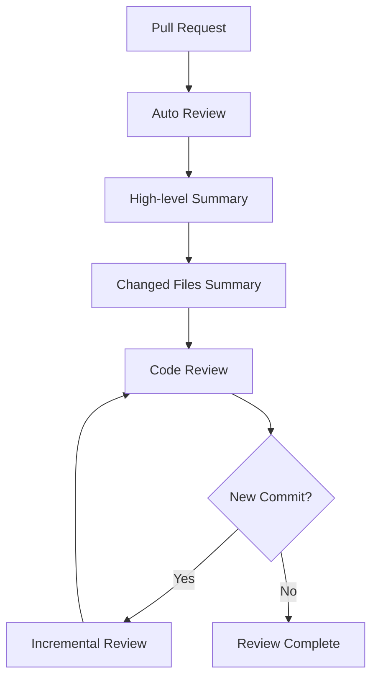

Review 설정에서는 다음 기능을 활용합니다.

```text
High-level Summary
Changed Files Summary
Sequence Diagram
Linked Issue Context
Related PR Context
Incremental Review
Web Search Reference
Auto Reply
```

단순히 코드 문제를 지적하는 것을 넘어 **원인과 개선 이유를 함께 이해하는 리뷰**를 지향합니다.

---

# 16. Deployment

## Local Development

Local 환경에서는 Vite Dev Server가 `/api` Request를 Backend로 Proxy합니다.

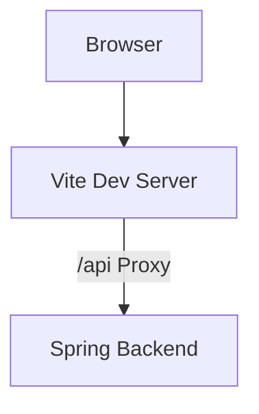

현재 개발 Proxy:

```text
/api/*
    ↓
https://tometa-final.duckdns.org/api/*
```

Browser 입장에서는 동일 Origin으로 요청하기 때문에 개발 과정에서 CORS와 Cookie 처리 부담을 줄입니다.

---

## Production

Frontend는 Vercel의 Rewrite를 활용합니다.

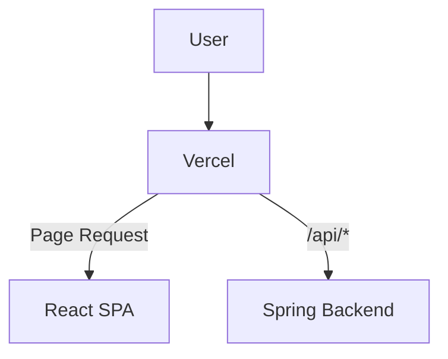

API:

```text
/api/:path*
      ↓
https://tometa-final.duckdns.org/api/:path*
```

SPA Routing:

```text
/*
 ↓
/
 ↓
React Router
```

따라서 사용자가 `/home`, `/record/...`, `/report/...` 등의 주소로 직접 접근하더라도 React Router가 화면을 처리합니다.

> [!NOTE]
> Local과 Production 모두 Frontend 코드에서는 `/api` Relative Path를 사용할 수 있도록 구성하여  
> Page마다 실행 환경에 따른 Backend URL을 직접 관리하지 않습니다.

---

# 17. AI in 낫트데이

낫트데이에서 AI는 목적이 아니라 **기록을 이해하기 위한 도구**입니다.

## Cosmetic Search

```text
User Keyword
     ↓
Frontend
     ↓
Spring Backend
     ↓
OpenAI + Web Search
     ↓
Validated Candidates
     ↓
Frontend
```

Frontend는 OpenAI와 직접 통신하지 않습니다.

---

## Daily / Weekly Report

```text
Skin Record
      +
Cosmetic Routine
      +
Health Data
      ↓
Backend AI Pipeline
      ↓
Validated Report
      ↓
Frontend Visualization
```

Frontend는 AI의 자유 형식 응답을 직접 Parsing하지 않고 Backend의 Report Contract만 다룹니다.

---

## AI Safety Boundary

| AI Role | 낫트데이 |
| --- | :---: |
| 의료 진단 | ❌ |
| 질병 확정 | ❌ |
| 치료 / 약물 처방 | ❌ |
| 특정 요인을 직접 원인으로 단정 | ❌ |
| 사용자 기록 정리 | ✅ |
| 생활 데이터 시각화 | ✅ |
| 관찰 가능한 변화 설명 | ✅ |
| 일상적인 실천 Guide | ✅ |

> [!CAUTION]
> **낫트데이의 AI Report는 의료 진단을 목적으로 하지 않습니다.**
>
> AI는 사용자가 직접 기록하거나 Health Connect로 연결한 데이터 안에서  
> 피부와 생활의 변화를 돌아볼 수 있도록 돕습니다.

---

# 18. Market & Scalability

식품의약품안전처에 따르면 2024년 국내 화장품 생산실적은 약 **17조 5,426억 원**을 기록했으며, 기초화장용 제품 생산액은 **10조 원을 넘어섰습니다.**

낫트데이는 화장품 구매 자체보다 **구매 이후의 사용자 경험**에 집중합니다.

> 어떤 제품을 구매했는가가 아니라  
> **실제로 무엇을 사용했고, 그 기간 동안 내 피부는 어떻게 변했는가?**

를 기록합니다.

---

## Data Accumulation

```text
Day
│
└── Daily Skin Record
        ↓

Week
│
└── Daily + Weekly Report
        ↓

Month
│
└── Skin Timeline
        ↓

Long Term
│
└── Cosmetic / Lifestyle / Skin History
```

사용 기간이 길어질수록 개인화된 피부 History가 축적됩니다.

---

## Expansion

| Core Experience | Extended Experience |
| --- | --- |
| Daily Record | Long-term Trend |
| Weekly Report | 30 / 60 / 90 Days Comparison |
| Skin Photo | Before / After Timeline |
| Cosmetic Pouch | Cosmetic Usage Analysis |
| Timeline | Report Archive |

사용자의 건강 데이터를 외부에 판매하는 방향이 아니라  
**사용자 자신에게 돌아가는 분석·비교·보관 가치**를 중심으로 확장합니다.

---

# 19. Track Fit

낫트데이는 실제 Health Data를 사용자의 피부 기록과 연결하는 **Wellness Service**입니다.

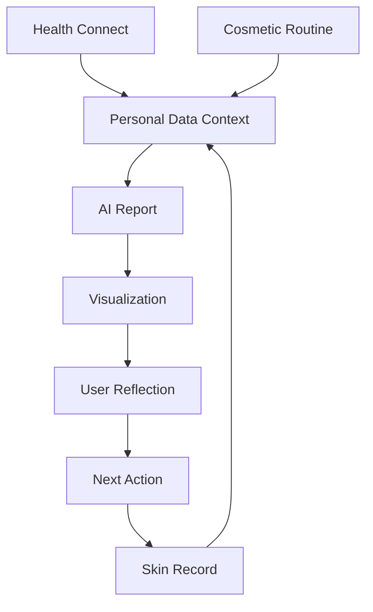

## ① Real Health Data

Demo용 건강 수치를 임의로 입력하는 대신 Android **Health Connect**를 실제 서비스 Flow에 연결합니다.

## ② AI as a Tool

AI Chat 자체를 핵심 기능으로 두지 않습니다.

```text
User Data
   ↓
Structured Backend
   ↓
AI Analysis
   ↓
Validated Report
   ↓
Frontend UX
```

AI는 사용자의 여러 기록을 이해하기 쉬운 형태로 정리하는 역할을 담당합니다.

## ③ Continuous Wellness Loop

```text
Record
  ↓
Analyze
  ↓
Reflect
  ↓
Act
  ↓
Record Again
```

일회성 결과가 아니라 반복적인 사용자 행동과 기록 축적을 지향합니다.

> **Track: [공식 제출 트랙명 입력]**

---

# 20. Project Structure

```text
14th-toMeta-frontend
│
├── 📂 public
│
├── 📂 src
│   │
│   ├── 🌐 api
│   │   ├── axios.js
│   │   ├── cosmetics.js
│   │   ├── healthConnect.js
│   │   ├── home.js
│   │   ├── onboarding.js
│   │   ├── records.js
│   │   ├── reports.js
│   │   └── user.js
│   │
│   ├── 🖼 assets
│   │   └── images
│   │
│   ├── 🧩 components
│   ├── 📌 constants
│   ├── 🪝 hooks
│   │
│   ├── 📱 pages
│   │   ├── DailyReport
│   │   ├── weeklyreport
│   │   │
│   │   ├── Splash.jsx
│   │   ├── Privacy.jsx
│   │   ├── HealthConnect.jsx
│   │   ├── ProfileInput.jsx
│   │   ├── SkintypeInput.jsx
│   │   ├── Notification.jsx
│   │   │
│   │   ├── Home.jsx
│   │   ├── TodayNote.jsx
│   │   ├── Record.jsx
│   │   │
│   │   ├── EmptyPouch.jsx
│   │   ├── MyPouch.jsx
│   │   ├── SearchCosmetic.jsx
│   │   ├── SearchResult.jsx
│   │   ├── CustomName.jsx
│   │   ├── CustomCategory.jsx
│   │   ├── CustomIngredient.jsx
│   │   ├── Set.jsx
│   │   │
│   │   ├── Report.jsx
│   │   ├── Mypage.jsx
│   │   └── EditProfile.jsx
│   │
│   ├── 🎨 styles
│   ├── 🛠 utils
│   ├── App.jsx
│   └── main.jsx
│
├── .coderabbit.yaml
├── .prettierrc
├── eslint.config.js
├── vite.config.js
├── vercel.json
├── package.json
└── package-lock.json
```

## Directory Responsibility

| Directory | Responsibility |
| --- | --- |
| `api/` | Spring Backend API Client |
| `assets/` | Image / SVG Assets |
| `components/` | Reusable UI Components |
| `constants/` | Shared Constants |
| `hooks/` | Reusable React Logic |
| `pages/` | Route-level Page / User Flow |
| `styles/` | Global / Layout / Component Style |
| `utils/` | Generic Utility |

---

# 21. Getting Started

<details>
<summary><b>📌 1. Requirements</b></summary>

<br/>

```text
Node.js
npm
```

전체 Hybrid Application 기능을 확인하려면 추가로

```text
낫트데이 Spring Backend
Android WebView Host App
Health Connect 지원 Android Device
```

가 필요합니다.

</details>

---

<details>
<summary><b>📥 2. Clone Repository</b></summary>

<br/>

```bash
git clone https://github.com/LikeLionUniv-INU/14th-toMeta-frontend.git

cd 14th-toMeta-frontend
```

</details>

---

<details>
<summary><b>📦 3. Install Dependencies</b></summary>

<br/>

```bash
npm ci
```

</details>

---

<details>
<summary><b>⚙️ 4. Environment Variable</b></summary>

<br/>

```env
VITE_API_URL=
```

`VITE_API_URL`이 설정되어 있으면 해당 주소를 Backend Base URL로 사용합니다.

설정되어 있지 않은 경우 Relative `/api` Request를 사용합니다.

```text
VITE_API_URL 설정
        │
        ├── Yes → 해당 Base URL
        │
        └── No
             ↓
           /api/*
             ↓
       Proxy / Rewrite
```

</details>

---

<details>
<summary><b>🚀 5. Development Server</b></summary>

<br/>

```bash
npm run dev
```

Local 환경의 `/api` Request는 Vite Proxy를 통해 Backend로 전달됩니다.

</details>

---

<details>
<summary><b>🔨 6. Production Build</b></summary>

<br/>

```bash
npm run build
```

Build 결과는 `dist/`에 생성됩니다.

</details>

---

<details>
<summary><b>👀 7. Preview Production Build</b></summary>

<br/>

```bash
npm run preview
```

</details>

---

<details>
<summary><b>🧹 8. Lint</b></summary>

<br/>

```bash
npm run lint
```

</details>

---

# 22. Screens

실제 모바일 화면을 추가하면 README만으로도  
**온보딩 → Home → 기록 → 화장품 → Report** 흐름을 빠르게 이해할 수 있습니다.

권장 파일 구조:

```text
docs
└── images
    ├── onboarding.png
    ├── home.png
    ├── daily-record.png
    ├── cosmetic-pouch.png
    ├── daily-report.png
    └── weekly-report.png
```

이미지를 추가한 뒤 아래 HTML 주석을 제거합니다.

<!--

<table align="center">
  <tr>
    <td align="center">
      <b>Health Connect</b><br/><br/>
      
    </td>
    <td align="center">
      <b>Home</b><br/><br/>
      
    </td>
    <td align="center">
      <b>Daily Record</b><br/><br/>
      
    </td>
  </tr>
  <tr>
    <td align="center">
      <b>Cosmetic Pouch</b><br/><br/>
      
    </td>
    <td align="center">
      <b>Daily Report</b><br/><br/>
      
    </td>
    <td align="center">
      <b>Weekly Report</b><br/><br/>
      
    </td>
  </tr>
</table>

-->

---

# 23. Team ToMeta

<div align="center">

### 👥 낫트데이를 만드는 사람들

**Planning · Design · Frontend · Backend**

</div>

<br/>

| Profile | Name | Role |
| :---: | :---: | :---: |
| 👤 | **강한별** | Planning |
| 🎨 | **박서현** | Design |
|  | **김지연** | Frontend |
|  | **김남윤** | Frontend |
|  | **임재영** | Backend |
|  | **장수빈** | Backend |

<br/>

### GitHub Contributors

<div align="center">

<a href="https://github.com/LikeLionUniv-INU/14th-toMeta-frontend/graphs/contributors">
  
</a>

</div>

---

# 24. References

## Research

**[1] Tan J.K.L., Bhate K.**  
*A global perspective on the epidemiology of acne.*  
British Journal of Dermatology, 2015.  
PMID: `25597339`

**[2] Meixiong J. et al.**  
*Diet and acne: A systematic review.*  
JAAD International, 2022.  
PMID: `35373155`

---

## Platform

**[3] Android Developers**  
*Health Connect — Android Health & Fitness*

Health Connect는 사용자 권한을 기반으로 여러 Health / Fitness Application의 데이터를 표준화된 방식으로 연결할 수 있도록 제공하는 Android Platform입니다.

---

## Market

**[4] 식품의약품안전처**  
*'24년 화장품 생산·수출액, 모두 사상 최대실적 기록*, 2025.

2024년 국내 화장품 생산실적은 약 **17조 5,426억 원**을 기록했습니다.

---

# Disclaimer

> [!IMPORTANT]
> **낫트데이는 의료 서비스가 아닌 Wellness 서비스입니다.**
>
> 서비스에서 제공하는 AI 분석 및 생활 가이드는 의료인의 진단, 치료 또는 처방을 대체하지 않습니다.  
> 피부 질환에 대한 정확한 진단이나 치료가 필요한 경우 의료 전문가와 상담해야 합니다.

---

<div align="center">

### 🧴 피부를 기억하지 말고, 기록하세요.

## 낫트데이 · Not Trouble Day

**Record · Connect · Reflect**

<br/>

<sub>Made with 🌿 by Team ToMeta</sub>

<br/><br/>


</div>

!footer
